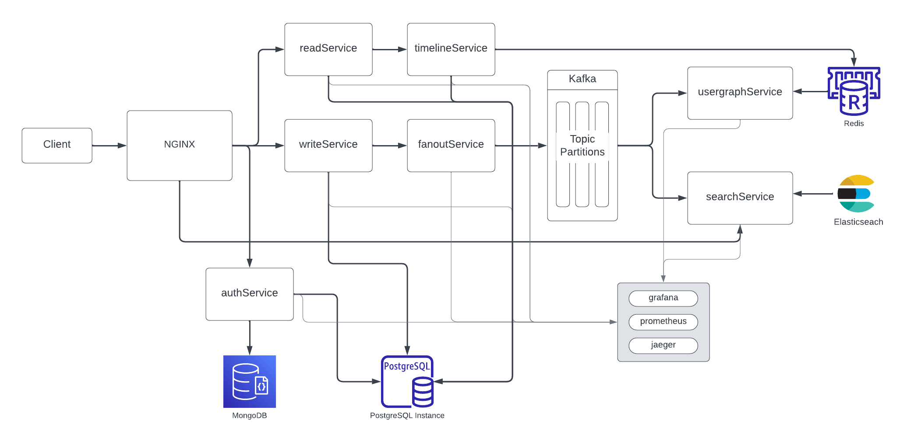

# TweetBit

A microservices based clone of Twitter.

## Use cases and constraints

### Use cases
- User posts a tweet
    - Service pushes tweets to followers, sending push notifications
- User views the user timeline (activity from the user)
- User views the home timeline (activity from people the user is following)
- User searches a keyword
- Service has high availability

### Constraints and assumptions

#### State Assumptions

#### General
- Traffic is not evenly distributed
- Posting a tweet should be fast
    - Fanning out a tweet to all of your folowers should be fast, unless you have _millions_ of followers
- Each tweet averages a fanout of 10 deliveries

#### Timeline
- Viewing the timeline should be fast
- Tweetbit is more read heavy than write heavy
    - Optimize for fast reads of tweets
- Timeline is not ordered   
    - Tweets are not ordered by time, but by relevance
    - Tweets are ordered by relevance, which is determined by the number of likes, retweets, and comments

#### Search
- Searching should be fast and accurate
- Search is read heavy

## High level design


## Detailed design

### User posts a tweet
- The client posts a tweet to the NGINX, running as a reverse proxy
- NGINX forwards the request to the writeService
- The writeService stores the the tweet in the Postgres database and forwards the tweet to the fanoutService
- The fanoutService fans out the tweet to other services, which does the following:
    - Queries the usergraphService to find all the followers of the user stored in the memory cache
    - Stores the tweet in the home timeline of the user's followers in the memory cache
        - O(n) operation: 1,000 followers = 1,000 lookups and inserts
    - SearchService stores the tweet in the ElasticSearch to enable fast searching

Redis is used as the Memory Cache, and utilizes the Redis list with the following structure:
```
createTweet {
    id uuid user_id content created_at likes_count retweets_count
}

followUser {
    user_id follower_id
}
```

### User follows or unfollows a user
- Similarly to posting a tweet, the client sends a request to the NGINX, which forwards the request to the writeService
- The writeService stores the follow relationship in the Postgres database and forwards the request to the fanoutService
- The fanoutService fans out the follow relationship to other services, which does the following:
    - Stores the follow relationship in the usergraphService in the memory cache
        - O(n) operation: 1,000 followers = 1,000 lookups and inserts

### User views the home timeline
- The client sends a request to the NGINX, which forwards the request to the readService
- The readService queries the timelineService, which does the following:
    - Gets the timeline data stored in the memory cache
    - sorts the timeline data by relevance, which is determined by the number of likes, retweets, and comments

### User views the user timeline
- The client sends a request to the NGINX, which forwards the request to the readService
- The readService retrieves the timeline data from the Postgres database

### User searches a keyword
- The client sends a request to the NGINX, which forwards the request to the searchService
- The searchService queries the ElasticSearch database and returns the results
- Before returning the results, searchService does the following:
    - Merge and ranks the results from the ElasticSearch database with the timeline data stored in the memory cache

## Scale the design
